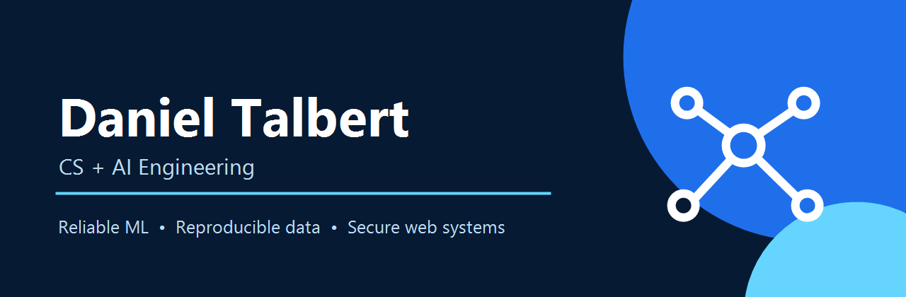

# Daniel Talbert

Computer Science + AI Engineering student building reliable ML systems, data products, and secure web applications.

I like the part of engineering after the demo: defining honest evaluation boundaries, turning experiments into repeatable pipelines, testing failure modes, documenting provenance, and making the result understandable to the next person.

## Selected work

| Project | What it demonstrates |
|---|---|
| [Traffic Sign Recognition](https://github.com/danieltalbert/traffic-sign-resnet50) | TensorFlow/ResNet50 pipeline for 43 classes with grouped validation, sign-safe test-time augmentation, reproducible artifacts, and 19 regression tests. |
| [Emvera](https://github.com/danieltalbert/emvera) | Security-focused Django finance sandbox with PostgreSQL, Plaid integration, TOTP, containerization, ownership controls, and 205 tests. |
| [Pizza Sales Performance](https://github.com/danieltalbert/pizza-sales-performance-analysis) | Reproducible pandas analysis of 48,620 transactions with a validated CLI, four decision-ready figures, source provenance, and CI. |
| [Data Science Portfolio](https://github.com/danieltalbert/data-science-portfolio) | Leakage-aware property-age classification: 92.36% accuracy and 0.9768 ROC-AUC on a fixed 4,583-row holdout. |
| [Neural Quest](https://github.com/danieltalbert/neural-quest) | Godot learning adventure with 20 worlds, 60 reachable shards, content validation, and headless engine CI. |
| [Gradientfall](https://github.com/danieltalbert/gradientfall) | Active Godot vertical slice combining procedural terrain, combat, companions, and a schema-validated content pipeline. |

## More builds

- [StudentRex](https://github.com/danieltalbert/studentrex-rexburg-guide) — source-backed, responsive local activity guide with eight curated listings and browser-tested filters.
- [StudyFlow](https://github.com/danieltalbert/studyflow-academic-planner) — tested .NET academic planner with polymorphic entries, persistence, export, and idempotent completion scoring.
- [RPG Roll Aid](https://github.com/danieltalbert/rpg-roll-aid) — browser-native tabletop companion with local persistence and a tested dice engine.
- [Jake's Catering](https://github.com/danieltalbert/jakes-catering) — clearly labeled responsive portfolio concept exploring editorial layout without borrowed photography.

## How I work

- Treat data leakage, ownership boundaries, and unsafe defaults as correctness bugs.
- Prefer deterministic validation and generated evidence over unsupported performance claims.
- Keep source, tests, CI, release notes, and the public story aligned.
- Preserve provenance: datasets, assets, experiments, and archived coursework are labeled honestly.

## Toolbox

Currently focused on evaluation-driven ML, trustworthy AI tooling, and shipping portfolio projects with production-minded engineering discipline.
