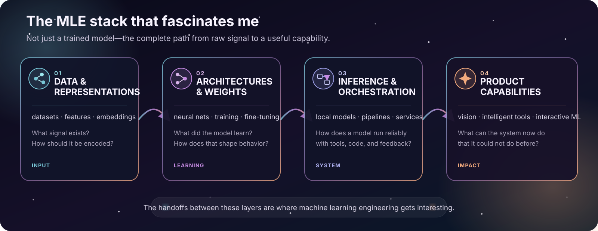

  

<h1 align="center">Daniel Talbert</h1>

  <strong>Aspiring machine learning engineer exploring neural networks, local inference, and the systems that turn models into capabilities.</strong>

  <a href="mailto:danieltalbertdev@gmail.com">Email</a>
  ·
  <a href="https://linkedin.com/in/robertdtalbert">LinkedIn</a>
  ·
  Seattle, Washington

## I want to understand the whole path

Machine learning fascinates me most when it moves beyond a notebook. I want to understand what the model is learning, how architectures and weights shape its behavior, what it takes to run inference locally or behind a service, and how data pipelines, evaluation, and orchestration turn a model into something a product can actually do.

That is the direction behind my work: computer vision experiments, reproducible data science, model-assisted content pipelines, ML education through games, and the software foundations those systems need. I am still becoming a stronger software engineer, but the reason I care about the engineering is simple: ambitious ML only becomes useful when the surrounding system can carry it.

## The stack that fascinates me

  

I am interested in every layer—and especially the handoffs between them. A metric can tell me whether an experiment worked; the full system determines whether that learning becomes a reliable capability.

## Proof in the work

<table>
  <tr>
    <td width="50%" valign="top">
      
       
      <strong>Traffic Sign ResNet50 · modeling + inference</strong>
       
      TensorFlow · transfer learning · fine-tuning · class weights · TTA
      
Removed a 99.92% physical-sign group overlap from the original evaluation, then reached <strong>92.90% accuracy</strong> and <strong>91.29% macro F1</strong> on 7,830 images from 261 unseen sign groups.

    </td>
    <td width="50%" valign="top">
      
       
      <strong>Data Science Portfolio · data + evaluation</strong>
       
      pandas · scikit-learn · feature boundaries · reproducible reporting
      
Built a tested property-age classifier over 22,913 records with a fixed holdout, explicit leakage exclusions, generated evidence, and a <strong>0.9768 ROC-AUC</strong>.

    </td>
  </tr>
  <tr>
    <td width="50%" valign="top">
      
       
      <strong>Gradientfall · generation + orchestration</strong>
       
      external models · JSON schemas · validation gates · Godot runtime
      
Designed a model-assisted content flow where briefs become generated JSON, enter a non-shipping inbox, pass machine validation and editorial review, and only then become runtime-loaded game content.

    </td>
    <td width="50%" valign="top">
      
       
      <strong>Neural Quest · ML as an interactive experience</strong>
       
      features · classical models · deep learning · representations · attention
      
Turns a 20-world ML curriculum into places, tutors, experiments, encounters, and boss checks so the concepts become interactions instead of vocabulary lists.

    </td>
  </tr>
  <tr>
    <td width="50%" valign="top">
      
       
      <strong>Emvera · secure application systems</strong>
       
      Django · Plaid Sandbox · PostgreSQL · TOTP · Docker · 205 tests
      
Builds the kind of secure, owner-scoped, observable application foundation that future data and model capabilities should inherit rather than work around.

    </td>
    <td width="50%" valign="top">
      
       
      <strong>Pizza Sales Analysis · data into decisions</strong>
       
      pandas · validation · aggregation · decision-ready visualization
      
Transforms 48,620 transaction lines into reproducible views of demand, staffing pressure, category performance, and product opportunity.

    </td>
  </tr>
</table>

## Questions I am actively chasing

- How far can useful inference move onto local hardware, and what changes when privacy, latency, memory, and compute become hard constraints?
- How do data quality, representations, architecture, learned weights, and evaluation interact in a model's real behavior?
- How should orchestration combine models, tools, deterministic code, validation, and feedback loops?
- What turns a successful model experiment into a capability that people can actually notice and use?

## Where I am heading

I am working toward the ability to take a model from raw data all the way to a useful, observable capability. The next stretch of that path is deeper neural-network and representation-learning intuition, more hands-on work with local models and inference tradeoffs, stronger end-to-end data/model pipelines, and the production engineering needed to make those systems dependable.

### Working stack

  
  
  
  
  
  
  
  
  

If you want to talk about applied ML, local inference, model systems, or building unusual AI-powered products, reach me at [danieltalbertdev@gmail.com](mailto:danieltalbertdev@gmail.com).
