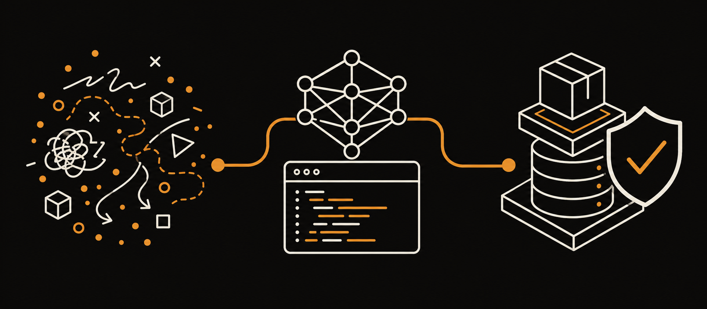
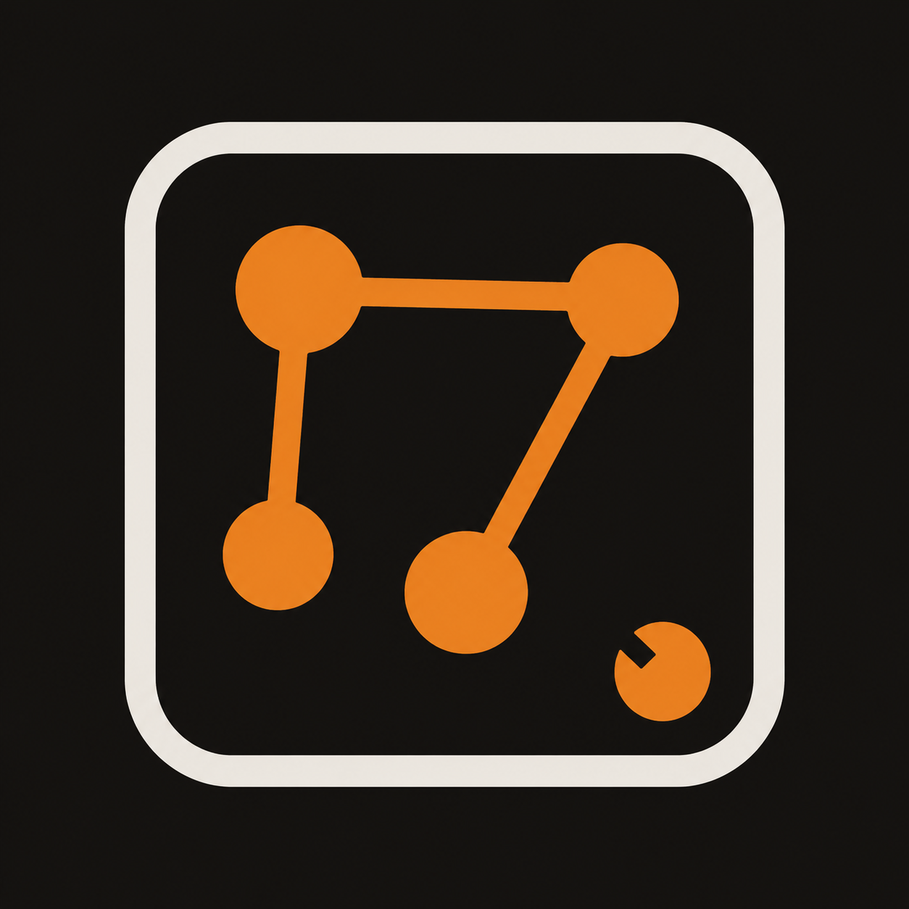
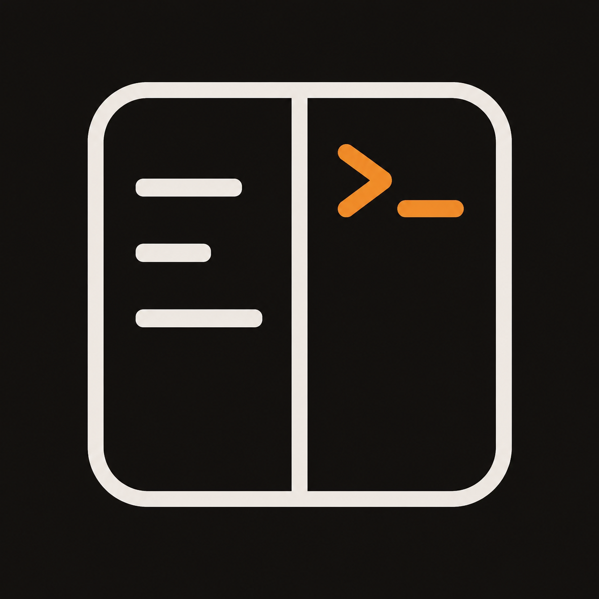
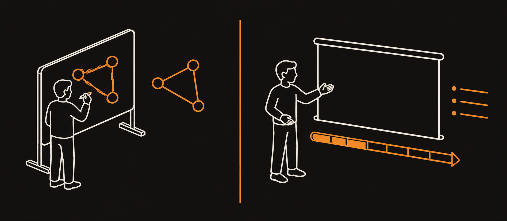

  

<h1 align="center">Daniel Talbert</h1>

  <strong>CS + AI engineering student building reliable ML systems, data products, and secure web applications.</strong>

  <a href="mailto:danieltalbertdev@gmail.com">Email</a>
  ·
  <a href="https://linkedin.com/in/robertdtalbert">LinkedIn</a>
  ·
  Seattle, Washington

## I build systems that explain themselves

I enjoy the point where modeling, software engineering, and communication meet. A result should be reproducible, its limitations should be visible, and a reviewer should be able to follow the evidence without reverse-engineering the project.

<table>
  <tr>
    <td width="50%" align="center">
      
       
      <strong>Honest models</strong>
       
      Group-aware evaluation, leakage prevention, provenance, and metrics that match the real question.
    </td>
    <td width="50%" align="center">
      
       
      <strong>Durable software</strong>
       
      Tested interfaces, security boundaries, automation, and documentation that stays close to the code.
    </td>
  </tr>
</table>

## Selected work

| Project | What makes it useful |
| --- | --- |
| [Data Science Portfolio](https://github.com/danieltalbert/data-science-portfolio) | A reproducible property-age case study with leakage-resistant features, a fixed holdout, generated evidence, and CI. |
| [Emvera](https://github.com/danieltalbert/emvera) | A security-focused Django finance sandbox with owner-scoped data, Plaid Sandbox, TOTP, PostgreSQL, Docker, and 205 tests. |
| [Traffic Sign ResNet50](https://github.com/danieltalbert/traffic-sign-resnet50) | A 43-class computer-vision system rebuilt around physical-sign group validation after detecting near-total frame leakage. |
| [Gradientfall](https://github.com/danieltalbert/gradientfall) | A Godot action-adventure vertical slice where ML concepts become geography, combat, quests, and schema-validated content. |
| [Neural Quest](https://github.com/danieltalbert/neural-quest) | A pixel-art learning game with 20 ML worlds, interactive labs, validated content, and headless engine checks. |
| [Pizza Sales Analysis](https://github.com/danieltalbert/pizza-sales-performance-analysis) | A decision-oriented analysis of 48,620 order lines with a reproducible dashboard and tested data pipeline. |

## How I work

  

I try to make the path from an early idea to a reviewed result visible:

1. Frame the question and its boundaries.
2. Turn the idea into a small, testable system.
3. Verify it with evidence that reflects real use.
4. Document what works, what does not, and what comes next.

## Engineering principles

- **Evaluation before optimization.** A strong score is only useful when the split, sample, and metric are honest.
- **Security is a product property.** Authentication, ownership, secrets, and failure behavior belong in the design.
- **Reproducibility is part of communication.** Tests, generated artifacts, and exact commands make claims inspectable.
- **Ambition needs boundaries.** I label prototypes, sandbox integrations, concept artwork, and future work clearly.

## Current direction

I am actively iterating on Gradientfall, deepening my machine-learning systems practice, and learning more about production infrastructure. I am especially interested in roles where careful experimentation and dependable software matter equally.
