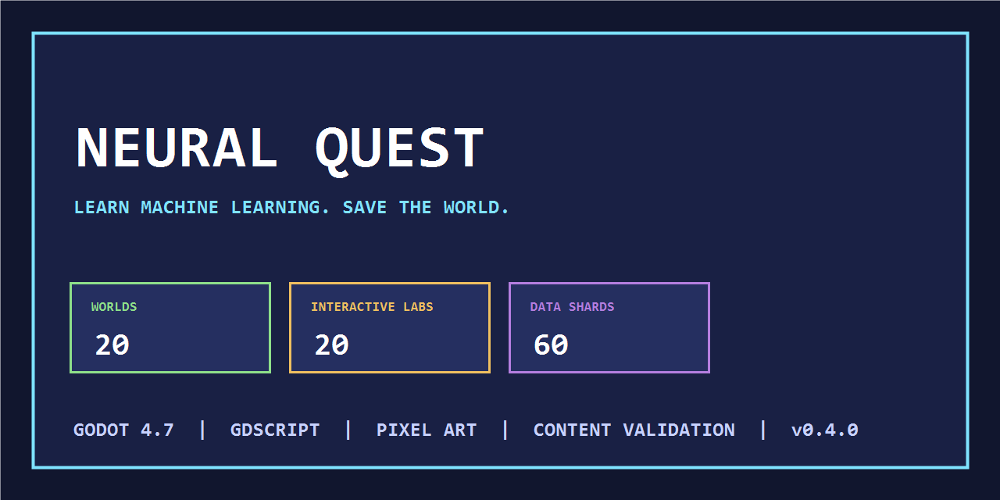
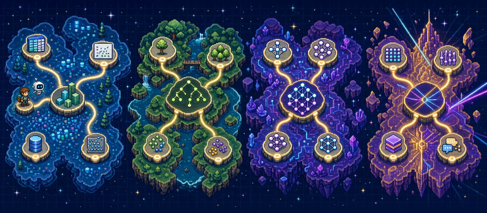

# Neural Quest

[](https://github.com/danieltalbert/neural-quest/actions/workflows/verify.yml)
[](https://godotengine.org/)
[](CHANGELOG.md)
[](LICENSE)

Neural Quest is a compact, pixel-art Godot adventure that teaches machine-learning fundamentals through exploration, tutors, quizzes, experiments, collectibles, and rematch battles. It treats education as game content: every concept has a location, a character, an interactive lab, and a progression reward.



## A curriculum you can travel through



This is **conceptual curriculum artwork, not a gameplay screenshot**. It visualizes the release's four-act learning arc: begin with data and features, move through classical models, build intuition for neural networks, and finish with modern representation and attention ideas. The shipped game expresses that journey through 20 authored worlds, tutors, labs, encounters, and boss checks.

## Release scope

- 20 themed worlds across four acts, each with a boss portal and concept quiz.
- 20 two-page tutors, 20 mini encounters, and 20 interactive ML labs.
- Connected overworld with 60 reachable data shards and an in-game minimap.
- Quest journal, Databot pet, Golden Glitch event, achievements, titles, streaks, and persistent progression.
- Card-battle boss rematches and a content-authored difficulty curve.
- Procedurally authored pixel art, chiptune-style music, and sound effects committed as reproducible assets.
- Automated validation for world count, answers, map connectivity, shard placement, palettes, and achievements.

## Repository guide

```text
autoload/       content, state, audio, and toast singletons
data/           20-world curriculum, map topology, and progression metadata
scenes/         gameplay, UI, encounters, labs, tutors, and world scripts
art/            code-authored pixel-art helpers
assets/         generated music and sound effects
tools/          map/audio generation and content validation
project.godot   Godot 4.7 entry point
```

## Run locally

Requirements: Godot 4.7.1 and Python 3.11+.

```powershell
python tools/validate_content.py
godot --editor --path .
```

CI also opens the project headlessly and treats parse/load errors in Godot's output as failures.

## Learning design

The curriculum progresses from prediction and features through ensembles, unsupervised learning, deep learning, and attention. Labs turn each idea into a small interactive manipulation instead of relying only on multiple choice. The data validator makes the authored contract inspectable: content counts, answer indices, path reachability, and world metadata are checked before the engine starts.

## Provenance

Neural Quest was extracted from the `danieltalbert` profile repository with its path history intact, then updated from a verified source-only snapshot of active local work. Generated engine caches and agent-only metadata were excluded.

## License

Original code, documentation, pixel art, music, and sound effects are available under the [MIT License](LICENSE).
